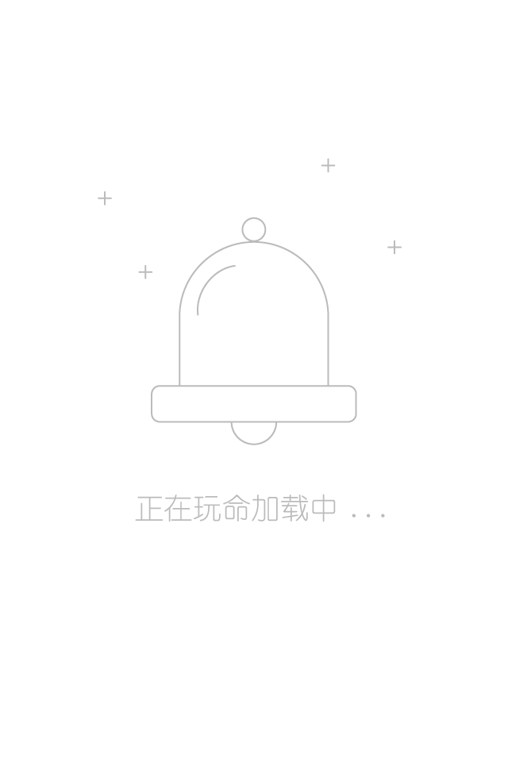

# ***库文档***

| 序号 | 分层                                   | 功能                      |
|:-----|:---------------------------------------|:-------------------------|
| 01   | 01. 服务器数据层                        | 数据库                   |
| 02   | 02. 服务器实体层entity                  | 数据库实体类data类型      |
| 03   | 03. 服务器持久层repository              | 数据库修改类interface类型 |
| 04   | 04. 服务器业务层service                 | 业务逻辑实现class类型     |
| 05   | 05. 服务器控制层controller              | 业务开关控制class类型     |
| 06   | 06. 服务器表现层：客户端实体层Model      | 对应数据实体data类型      |
| 07   | 07. 服务器表现层：客户端控制层Controller | 对应业务逻辑object类型    |
| 08   | 08. 服务器表现层：客户端视图层View       | 布局控件逻辑activity类型  |
| 09   | 09. 服务器表现层：客户端布局层View       | 布局控件位置xml类型       |

## **控件库widgeter归属客户端布局层**

| 序号 | 类库                                                                                                                                                                                                                                                                                                                                                   | 功能 |
|:-----|:------------------------------------------------------------------------------------------------------------------------------------------------------------------------------------------------------------------------------------------------------------------------------------------------------------------------------------------------------|:-----|
| 001  | *001.Divider(32)*                                                                                                                                                                                                                                                                                                                                     | 分隔 |
| 002  | *002.Title(203)*                                                                                                                                                                                                                                                                                                                                      | 标题 |
| 003  | *003.PopupImply(31)*                                                                                                                                                                                                                                                                                                                                  | 说明 |
| 004  | *004.PopupSingle(111)*                                                                                                                                                                                                                                                                                                                                | 弹表 |
| 005  | *005.PopupViewManager：PopupView、BackgroundConstructor、Coordinates、CoordinatesFinder(533)*                                                                                                                                                                                                                                                          | 弹框 |
| 006  | *006.NoticeHelper：NoticeBase、NoticeBigPic、NoticeBigText、NoticeMailbox、NoticeProgress、NoticeCustomView(473)*                                                                                                                                                                                                                                      | 通知 |
| 007  | *007.SeekBar(755)*                                                                                                                                                                                                                                                                                                                                    | 拖动 |
| 008  | *008.ProgressBar(258)*                                                                                                                                                                                                                                                                                                                                | 进度 |
| 009  | *009.ProgressRound(165)*                                                                                                                                                                                                                                                                                                                              | 弧度 |
| 010  | *010.RunTextView(12)*                                                                                                                                                                                                                                                                                                                                 | 跑马 |
| 011  | *011.TextAutoZoom(210)*                                                                                                                                                                                                                                                                                                                               | 字调 |
| 012  | *012.TextViewVertical(100)*                                                                                                                                                                                                                                                                                                                           | 单滚 |
| 013  | *013.TextViewVerticalMore(40)*                                                                                                                                                                                                                                                                                                                        | 多滚 |
| 014  | *014.AutoImageView(35)*                                                                                                                                                                                                                                                                                                                               | 平滚 |
| 015  | *015.PinView：ScaleImageView、ImageSource、ImageViewState、DecoderFactory、ImageDecoder、RegionDecoder(34+2115)*                                                                                                                                                                                                                                       | 图调 |
| 016  | *016.Captcha(117)*                                                                                                                                                                                                                                                                                                                                    | 验证 |
| 017  | *017.SwipeCaptcha(393)*                                                                                                                                                                                                                                                                                                                               | 滑块 |
| 018  | *018.ScratchCard(48)*                                                                                                                                                                                                                                                                                                                                 | 刮刮 |
| 019  | *019.CardStackView：AdapterAnimator、AdapterAllMoveDownAnimator、AdapterUpDownAnimator、AdapterUpDownStackAnimator、ViewDataObserver、AdapterDataObservable、ViewHolder、Adapter、AdapterStack、DelegateScrollStack、DelegateScroll(861+36+7)*                                                                                                          | 卡组 |
| 020  | *020.CobwebView：RotateInfo(411)*                                                                                                                                                                                                                                                                                                                     | 蛛网 |
| 021  | *021.NetSpeedView(155)*                                                                                                                                                                                                                                                                                                                               | 网速 |
| 022  | *022.SeatAirplane(890)*                                                                                                                                                                                                                                                                                                                               | 机座 |
| 023  | *023.SeatMovie(717)*                                                                                                                                                                                                                                                                                                                                  | 影座 |
| 024  | *024.RulerWheelView(464)*                                                                                                                                                                                                                                                                                                                             | 刻度 |
| 025  | *025.ShoppingView(362)*                                                                                                                                                                                                                                                                                                                               | 商品 |
| 026  | *026.ShineView：ShineButton、PorterShapeImageView、PorterImageView、ShineAnimator、EasingInterpolator、EasingProvider、Ease(699)*                                                                                                                                                                                                                      | 点赞 |
| 027  | *027.HeartLayout：FloatAnimation、PathAnimator、HeartView(241)*                                                                                                                                                                                                                                                                                        | 爱心 |
| 028  | *028.WaveView(231)*                                                                                                                                                                                                                                                                                                                                   | 水波 |
| 029  | *029.SideBar(240)*                                                                                                                                                                                                                                                                                                                                    | 侧边 |
| 030  | *030.Banner：BannerHelper、TypeBannerTrans、BeanPage、PageListener、RecyclerViewHolder、RecyclerBaseAdapter、TypeTrans、Transformer、TransformerCard、TransformerDepthPage、TransformerMz、TransformerZoomOutPage、BeanCircle、BeanRect、TypeIndicatorCircle、IndicatorCircle、IndicatorRect、IndicatorText(1060)*                                       | 横幅 |
| 031  | *031.LayoutTab、LayoutLabel：LayoutScroll、LayoutFlow、AttrsHelper、AdapterTab、AdapterLabel、AdapterTemplate、AdapterFlow、FlowListener、FlowListenerAdapter、ActionRect、ActionTri、ActionRound、ActionColor、ActionRes、ActionBase、ActionDot、TextViewTabColor、BeanTab、BeanLabel、TabValue、TabTypeEvaluator、ConstantsFlow、ViewPagerHelper(2120)* | 流式 |
| 032  | *032.BaseAdapterQuick、BaseAdapterBinder、BaseAdapterMultiDelegate、BaseAdapterMultiProvider(BaseAdapterNode)、BaseAdapterMultiQuick(BaseAdapterSectionQuick)、ViewHolderBase、LoadMoreModuleBase、UpFetchModuleBase、DraggableModuleBase：......(2960)*                                                                                                | 回收 |

>- values
>
>>1. [attrs.xml](../../../../res/values/attrs.xml)
>>2. [colors.xml](../../../../res/values/colors.xml)
>>3. [dimens.xml](../../../../res/values/dimens.xml)
>>4. [integers.xml](../../../../res/values/integers.xml)

### *001.分隔Divider(32)*

>- implementation "com.google.android.material:material:1.2.1"

### *002.标题Title(203)*

| 序号 | 方法                      | 功能 |
|:-----|:--------------------------|:----|
| 01   | 01. rootLayout            | 功能 |
| 02   | 02. leftLL                | 功能 |
| 03   | 03. leftIV                | 功能 |
| 04   | 04. leftTV                | 功能 |
| 05   | 05. rightLL               | 功能 |
| 06   | 06. rightIV               | 功能 |
| 07   | 07. rightTV               | 功能 |
| 08   | 08. textAutoZoom          | 功能 |
| 09   | 09. leftIcon              | 功能 |
| 10   | 10. isLeftIconVisibility  | 功能 |
| 11   | 11. leftText              | 功能 |
| 12   | 12. leftTextColor         | 功能 |
| 13   | 13. leftTextSize          | 功能 |
| 14   | 14. isLeftTextVisibility  | 功能 |
| 15   | 15. rightIcon             | 功能 |
| 16   | 16. isRightIconVisibility | 功能 |
| 17   | 17. rightText             | 功能 |
| 18   | 18. rightTextColor        | 功能 |
| 19   | 19. rightTextSize         | 功能 |
| 20   | 20. isRightTextVisibility | 功能 |
| 21   | 21. title                 | 功能 |
| 22   | 22. titleColor            | 功能 |
| 23   | 23. titleSize             | 功能 |
| 24   | 24. isTitleVisibility     | 功能 |
| 25   | 25. setLeftFinish         | 功能 |
| 26   | 26. setLeftListener       | 功能 |
| 27   | 27. setLeftIconListener   | 功能 |
| 28   | 28. setLeftTextListener   | 功能 |
| 29   | 29. setRightListener      | 功能 |
| 30   | 30. setRightIconListener  | 功能 |
| 31   | 31. setRightTextListener  | 功能 |

>- layout:[include_helper_title.xml](../../../../res/layout/include_helper_title.xml)
>- mipmap
>
>>1. 
>>2. 与PopupSingle共用

### *003.说明PopupImply(31)*

| 序号 | 方法     | 功能     |
|:-----|:---------|:--------|
| 01   | 01. show | 显示说明 |

>- layout:[popup_imply.xml](../../../../res/layout/popup_imply.xml)
>- mipmap:

### *004.弹表PopupSingle(111)*

| 序号 | 方法                    | 功能           |
|:-----|:------------------------|:--------------|
| 01   | 01. itemOnClickListener | 表项点击监听器 |
| 02   | 02. cleanAction         | 清空表项      |
| 03   | 03. addAction           | 添加表项      |
| 04   | 04. getAction           | 获取表项      |
| 05   | 05. colorItemText       | 弹表文本颜色   |
| 06   | 06. show                | 显示可选弹表   |

>- mipmap:与Title共用
>- layout
>
>>1. [popup_list_layout.xml](../../../../res/layout/popup_list_layout.xml)
>>2. [popup_list_item.xml](../../../../res/layout/popup_list_item.xml)

### *005.弹框PopupViewManager：PopupView、BackgroundConstructor、Coordinates、CoordinatesFinder(533)*

| 序号 | 方法                       | 功能 |
|:-----|:---------------------------|:----|
| 01   | 01. TipListener            | 功能 |
| 02   | 02. animationDuration      | 功能 |
| 03   | 03. show                   | 功能 |
| 04   | 04. clearTipsMap           | 功能 |
| 05   | 05. findAndDismiss         | 功能 |
| 06   | 06. find                   | 功能 |
| 07   | 07. dismiss                | 功能 |
| 08   | 08. isVisible              | 功能 |
| 09   | #### BackgroundConstructor | 功能 |
| 10   | 01. setBackground          | 功能 |
| 11   | #### Coordinates           | 功能 |
| 12   | 01. left                   | 功能 |
| 13   | 02. top                    | 功能 |
| 14   | 03. right                  | 功能 |
| 15   | 04. bottom                 | 功能 |
| 16   | #### CoordinatesFinder     | 功能 |
| 17   | 01. getCoordinates         | 功能 |
| 18   | #### PopupView             | 功能 |
| 19   | 01. context                | 功能 |
| 20   | 02. anchorView             | 功能 |
| 21   | 03. rootView               | 功能 |
| 22   | 04. message                | 功能 |
| 23   | 05. spannableMessage       | 功能 |
| 24   | 06. isShowArrow            | 功能 |
| 25   | 07. backgroundColor        | 功能 |
| 26   | 08. textColor              | 功能 |
| 27   | 09. textSize               | 功能 |
| 28   | 10. elevation              | 功能 |
| 29   | 11. offsetX                | 功能 |
| 30   | 12. offsetY                | 功能 |
| 31   | 13. textGravityTemp        | 功能 |
| 32   | 14. textGravity            | 功能 |
| 33   | 15. align                  | 功能 |
| 34   | 16. position               | 功能 |
| 35   | 17. isHideArrow            | 功能 |
| 36   | 18. isTextGravityCenter    | 功能 |
| 37   | 19. isTextGravityLeft      | 功能 |
| 38   | 20. isTextGravityRight     | 功能 |
| 39   | 21. isAlignedCenter        | 功能 |
| 40   | 22. isAlignedLeft          | 功能 |
| 41   | 23. isAlignedRight         | 功能 |
| 42   | 24. isPositionedAbove      | 功能 |
| 43   | 25. isPositionedBelow      | 功能 |
| 44   | 26. isPositionedLeftTo     | 功能 |
| 45   | 27. isPositionedRightTo    | 功能 |
| 46   | ##### BuilderPopupView     | 功能 |
| 47   | 01. mContext               | 功能 |
| 48   | 02. mAnchorView            | 功能 |
| 49   | 03. mRootView              | 功能 |
| 50   | 04. mMessage               | 功能 |
| 51   | 05. mSpannableMessage      | 功能 |
| 52   | 06. mIsShowArrow           | 功能 |
| 53   | 07. mBackgroundColor       | 功能 |
| 54   | 08. mTextColor             | 功能 |
| 55   | 09. mTextSize              | 功能 |
| 56   | 10. mElevation             | 功能 |
| 57   | 11. mOffsetX               | 功能 |
| 58   | 12. mOffsetY               | 功能 |
| 59   | 13. mTextGravity           | 功能 |
| 60   | 14. mAlign                 | 功能 |
| 61   | 15. mPosition              | 功能 |
| 62   | 16. BuilderPopupView       | 功能 |
| 63   | 17. buildPopupView         | 功能 |

### *006.通知NoticeHelper：NoticeBase、NoticeBigPic、NoticeBigText、NoticeMailbox、NoticeProgress、NoticeCustomView(473)*

| 序号 | 方法                            | 功能                         |
|:-----|:--------------------------------|:-----------------------------|
| 01   | 01. buildSimple                 | 构建简单通知                 |
| 02   | 02. buildBigPic                 | 构建带图片通知                |
| 03   | 03. buildBigText                | 构建多文本通知                |
| 04   | 04. buildMailBox                | 构建带多条消息合并的消息盒通知 |
| 05   | 05. buildProgress               | 构建带进度条通知，可无精确进度 |
| 06   | 06. buildCustomView             | 构建自定义通知                |
| 07   | 07. isNotifyPermissionOpen      | 通知栏权限是否获取            |
| 08   | 08. openNotifyPermissionSetting | 打开通知栏权限设置页面        |
| 09   | 09. getManager                  | 获取通知管理器                |
| 10   | 10. notify                      | 通知                         |
| 11   | 11. cancel                      | 取消通知                     |
| 12   | 12. cancelAll                   | 取消所有通知                 |

### *007.拖动SeekBar(755)*

| 序号 | 方法                            | 功能 |
|:-----|:--------------------------------|:----|
| 01   | 01. min                         | 功能 |
| 02   | 02. max                         | 功能 |
| 03   | 03. isHintHolder                | 功能 |
| 04   | 04. setLeftProgressDescription  | 功能 |
| 05   | 05. setRightProgressDescription | 功能 |
| 06   | 06. setProgressDescription      | 功能 |
| 07   | 07. setRange                    | 功能 |
| 08   | 08. setRules                    | 功能 |
| 09   | 09. currentRange                | 功能 |
| 10   | 10. setEnabled                  | 功能 |
| 11   | 11. onRangeChangedListener      | 功能 |
| 12   | 12. setValue                    | 功能 |

>- mipmap
>
>>1. 
>>2. 

### *008.进度ProgressBar(258)*

| 序号 | 方法              | 功能 |
|:-----|:------------------|:----|
| 01   | 01. isStop        | 功能 |
| 02   | 02. isFinish      | 功能 |
| 03   | 03. finishLoad    | 功能 |
| 04   | 04. progress      | 功能 |
| 05   | 05. resetProgress | 功能 |
| 06   | 06. toggle        | 功能 |
| 07   | 07. setStop       | 功能 |

>- 

### *009.弧度ProgressRound(165)*

| 序号 | 方法                    | 功能 |
|:-----|:------------------------|:----|
| 01   | 01. circleColor         | 功能 |
| 02   | 02. circleProgressColor | 功能 |
| 03   | 03. textColor           | 功能 |
| 04   | 04. textSize            | 功能 |
| 05   | 05. roundWidth          | 功能 |
| 06   | 06. max                 | 功能 |
| 07   | 07. STROKE              | 功能 |
| 08   | 08. FILL                | 功能 |
| 09   | 09. progress            | 功能 |

### *010.跑马RunTextView(12)*

### *011.字调TextAutoZoom(210)*

| 序号 | 方法                 | 功能 |
|:-----|:---------------------|:----|
| 01   | 01. setNormalization | 功能 |
| 02   | 02. minTextSize      | 功能 |
| 03   | 03. enableSizeCache  | 功能 |

>- [Title.kt](Title.kt)

### *012.单滚TextViewVertical(100)*

| 序号 | 方法                     | 功能 |
|:-----|:-------------------------|:----|
| 01   | 01. mTextSize            | 功能 |
| 02   | 02. mTextColor           | 功能 |
| 03   | 03. mPadding             | 功能 |
| 04   | 04. mOnItemClickListener | 功能 |
| 05   | 05. titles               | 功能 |
| 06   | 06. autoScrollStart      | 功能 |
| 07   | 07. autoScrollStop       | 功能 |
| 08   | 08. setTimeTextStill     | 功能 |
| 09   | 09. setTimeAnim          | 功能 |

### *013.多滚TextViewVerticalMore(40)*

| 序号 | 方法                    | 功能 |
|:-----|:------------------------|:----|
| 01   | 01. interval            | 功能 |
| 02   | 02. animDuration        | 功能 |
| 03   | 03. isSetAnimDuration   | 功能 |
| 04   | 04. onItemClickListener | 功能 |
| 05   | 05. setViews            | 功能 |

>- anim
>
>>1. [anim_marquee_in.xml](../../../../res/anim/anim_marquee_in.xml)
>>2. [anim_marquee_out.xml](../../../../res/anim/anim_marquee_out.xml)

### *014.平滚AutoImageView(35)*

| 序号 | 方法          | 功能 |
|:-----|:--------------|:----|
| 01   | 01. imageView | 功能 |

>1. anim:[anim_translate.xml](../../../../res/anim/anim_translate.xml)
>2. layout:[layout_auto_imageview.xml](../../../../res/layout/layout_auto_imageview.xml)

### *015.图调PinView：ScaleImageView、ImageSource、ImageViewState、DecoderFactory、ImageDecoder、RegionDecoder(34+2115)*

| 序号 | 方法                            | 功能 |
|:-----|:--------------------------------|:----|
| 01   | 01. scaleMax                    | 功能 |
| 02   | 02. scaleDoubleTapDpiZoom       | 功能 |
| 03   | 03. setOnLongClickListener      | 功能 |
| 04   | 04. isEnabledZoom               | 功能 |
| 05   | 05. scale                       | 功能 |
| 06   | 06. isReady                     | 功能 |
| 07   | 07. isEnabledPan                | 功能 |
| 08   | 08. onImageEventListener        | 功能 |
| 09   | 09. isDebug                     | 功能 |
| 10   | 10. parallelLoadingEnabled      | 功能 |
| 11   | 11. BuilderAnim                 | 功能 |
| 12   | 12. animateScale                | 功能 |
| 13   | 13. animateCenter               | 功能 |
| 14   | 14. animateScaleAndCenter       | 功能 |
| 15   | 15. isEnabledQuickScale         | 功能 |
| 16   | 16. viewToSourceCoord           | 功能 |
| 17   | 17. requiredRotation            | 功能 |
| 18   | 18. sWidth                      | 功能 |
| 19   | 19. sHeight                     | 功能 |
| 20   | 20. minScaleType                | 功能 |
| 21   | 21. panLimit                    | 功能 |
| 22   | 22. minScaleDpi                 | 功能 |
| 23   | 23. doubleTapZoomStyle          | 功能 |
| 24   | 24. doubleTapZoomDuration       | 功能 |
| 25   | 25. setScaleAndCenter           | 功能 |
| 26   | 26. resetScaleAndCenter         | 功能 |
| 27   | 27. setTileBackgroundColor      | 功能 |
| 28   | 28. maxTileWidth                | 功能 |
| 29   | 29. maxTileHeight               | 功能 |
| 30   | 30. imageDecoder                | 功能 |
| 31   | 31. regionDecoder               | 功能 |
| 32   | 32. setImage                    | 功能 |
| 33   | 33. hasImage                    | 功能 |
| 34   | 34. isImageLoaded               | 功能 |
| 35   | 35. orientation                 | 功能 |
| 36   | 36. state                       | 功能 |
| 37   | 37. center                      | 功能 |
| 38   | 38. onStateChangedListener      | 功能 |
| 39   | 39. sourceToViewCoord           | 功能 |
| 40   | 40. recycle                     | 功能 |
| 41   | 41. minTileDpi                  | 功能 |
| 42   | 42. ORIENTATION_0               | 功能 |
| 43   | 43. ORIENTATION_90              | 功能 |
| 44   | 44. ORIENTATION_180             | 功能 |
| 45   | 45. ORIENTATION_270             | 功能 |
| 46   | 46. ORIENTATION_USE_EXIF        | 功能 |
| 47   | 47. ZOOM_FOCUS_FIXED            | 功能 |
| 48   | 48. ZOOM_FOCUS_CENTER           | 功能 |
| 49   | 49. ZOOM_FOCUS_CENTER_IMMEDIATE | 功能 |
| 50   | 50. EASE_OUT_QUAD               | 功能 |
| 51   | 51. EASE_IN_OUT_QUAD            | 功能 |
| 52   | 52. PAN_LIMIT_INSIDE            | 功能 |
| 53   | 53. PAN_LIMIT_OUTSIDE           | 功能 |
| 54   | 54. PAN_LIMIT_CENTER            | 功能 |
| 55   | 55. SCALE_TYPE_CENTER_INSIDE    | 功能 |
| 56   | 56. SCALE_TYPE_CENTER_CROP      | 功能 |
| 57   | 57. SCALE_TYPE_CUSTOM           | 功能 |
| 58   | 58. ORIGIN_ANIM                 | 功能 |
| 59   | 59. ORIGIN_TOUCH                | 功能 |
| 60   | 60. ORIGIN_FLING                | 功能 |
| 61   | 61. ORIGIN_DOUBLE_TAP_ZOOM      | 功能 |
| 62   | 62. tileSizeAuto                | 功能 |
| 63   | #### PinView                    | 功能 |
| 64   | 01. pinS                        | 功能 |

>- mipmap
>
>>1. 
>>2. 
>>3. 
>>4. 
>>5. 
>>6. 
>>7. 
>>8. 
>>9. 
>>10. 

### *016.验证Captcha(117)*

| 序号 | 方法           | 功能 |
|:-----|:---------------|:----|
| 01   | 01. build      | 功能 |
| 02   | 02. mType      | 功能 |
| 03   | 03. codeLength | 功能 |
| 04   | 04. makeCode   | 功能 |
| 05   | 05. width      | 功能 |
| 06   | 06. height     | 功能 |
| 07   | 07. color      | 功能 |
| 08   | 08. fontSize   | 功能 |
| 09   | 09. code       | 功能 |
| 10   | 10. lineNumber | 功能 |
| 11   | 11. makeBitmap | 功能 |
| 12   | 12. into       | 功能 |

### *017.滑块SwipeCaptcha(393)*

| 序号 | 方法                       | 功能 |
|:-----|:---------------------------|:----|
| 01   | 01. maxSwipeValue          | 功能 |
| 02   | 02. onCaptchaMatchCallback | 功能 |
| 03   | 03. createCaptcha          | 功能 |
| 04   | 04. matchCaptcha           | 功能 |
| 05   | 05. resetCaptcha           | 功能 |
| 06   | 06. setCurrentSwipeValue   | 功能 |

### *018.刮刮ScratchCard(48)*

>- mipmap:

### *019.卡组CardStackView：AdapterAnimator、AdapterAllMoveDownAnimator、AdapterUpDownAnimator、AdapterUpDownStackAnimator、ViewDataObserver、AdapterDataObservable、ViewHolder、Adapter、AdapterStack、DelegateScrollStack、DelegateScroll(861+36+7)*

| 序号 | 方法                           | 功能 |
|:-----|:-------------------------------|:----|
| 01   | 01. overlapGaps                | 功能 |
| 02   | 02. overlapGapsCollapse        | 功能 |
| 03   | 03. duration                   | 功能 |
| 04   | 04. numBottomShow              | 功能 |
| 05   | 05. itemExpendListener         | 功能 |
| 06   | 06. selectPosition             | 功能 |
| 07   | 07. isExpending                | 功能 |
| 08   | 08. clearSelectPosition        | 功能 |
| 09   | 09. updateSelectPosition       | 功能 |
| 10   | 10. showHeight                 | 功能 |
| 11   | 11. clearScrollYAndTranslation | 功能 |
| 12   | 12. delegateScroll             | 功能 |
| 13   | 13. adapterAnimator            | 功能 |
| 14   | 14. setAnimationType           | 功能 |
| 15   | 15. scrollEnable               | 功能 |
| 16   | 16. totalLength                | 功能 |
| 17   | 17. viewScrollX                | 功能 |
| 18   | 18. viewScrollY                | 功能 |
| 19   | 19. scrollOffset               | 功能 |
| 20   | 20. fling                      | 功能 |
| 21   | 21. getViewHolder              | 功能 |
| 22   | 22. performItemClick           | 功能 |
| 23   | 23. adapterStack               | 功能 |
| 24   | 24. cardNext                   | 功能 |
| 25   | 25. cardPrevious               | 功能 |
| 26   | #### AdapterDataObservable     | 功能 |
| 27   | 01. notifyChanged              | 功能 |
| 28   | 02. hasObservers               | 功能 |
| 29   | #### ViewHolder                | 功能 |
| 30   | 01. context                    | 功能 |
| 31   | 02. itemViewType               | 功能 |
| 32   | 03. position                   | 功能 |
| 33   | 04. onAnimationStateChange     | 功能 |
| 34   | 05. onItemExpand               | 功能 |
| 35   | #### Adapter                   | 功能 |
| 36   | 01. itemCount                  | 功能 |
| 37   | 02. notifyDataSetChanged       | 功能 |
| 38   | 03. registerObserver           | 功能 |
| 39   | 04. createView                 | 功能 |
| 40   | 05. onCreateView               | 功能 |
| 41   | 06. bindViewHolder             | 功能 |
| 42   | 07. onBindViewHolder           | 功能 |
| 43   | 08. getItemViewType            | 功能 |
| 44   | #### AdapterStack              | 功能 |
| 45   | 01. layoutInflater             | 功能 |
| 46   | 02. dataList                   | 功能 |
| 47   | 03. itemCount                  | 功能 |
| 48   | 04. onBindViewHolder           | 功能 |
| 49   | 05. getItem                    | 功能 |
| 50   | 06. bindView                   | 功能 |

### *020.蛛网CobwebView：RotateInfo(411)*

| 序号 | 方法                       | 功能 |
|:-----|:---------------------------|:----|
| 01   | 01. spiderNameSize         | 功能 |
| 02   | 02. spiderMaxLevel         | 功能 |
| 03   | 03. spiderColor            | 功能 |
| 04   | 04. spiderRadiusColor      | 功能 |
| 05   | 05. spiderLevelColor       | 功能 |
| 06   | 06. spiderLevelStrokeColor | 功能 |
| 07   | 07. spiderLevelStrokeWidth | 功能 |
| 08   | 08. isSpiderLevelStroke    | 功能 |
| 09   | 09. isSpiderRotate         | 功能 |
| 10   | 10. ModelSpider            | 功能 |
| 11   | 11. spiderList             | 功能 |
| 12   | #### RotateInfo            | 功能 |
| 13   | 01. getAngleRotate         | 功能 |
| 14   | 02. getQuadrant            | 功能 |
| 15   | 03. getAngle               | 功能 |
| 16   | 04. CIRCLE_ANGLE           | 功能 |
| 17   | 05. getAngleNormalized     | 功能 |

### *021.网速NetSpeedView(155)*

| 序号 | 方法               | 功能 |
|:-----|:-------------------|:----|
| 01   | 01. isMulti        | 功能 |
| 02   | 02. timeInterval   | 功能 |
| 03   | 03. updateViewData | 功能 |
| 04   | 04. setTextColor   | 功能 |
| 05   | 05. setTextSize    | 功能 |

>- layout:[netspeed_view.xml](../../../../res/layout/netspeed_view.xml)

### *022.机座SeatAirplane(890)*

| 序号 | 方法                    | 功能 |
|:-----|:------------------------|:----|
| 01   | 01. setEmptySelecting   | 功能 |
| 02   | 02. maxSelectStates     | 功能 |
| 03   | 03. setSeatSelected     | 功能 |
| 04   | 04. bitmapSeatNormal    | 功能 |
| 05   | 05. bitmapSeatSelected  | 功能 |
| 06   | 06. bitmapSeatSelecting | 功能 |
| 07   | 07. getFontLength       | 功能 |
| 08   | 08. getFontHeight       | 功能 |
| 09   | 09. setBitmap           | 功能 |
| 10   | 10. goCabinPosition     | 功能 |

>- mipmap（SeatMovie共用）
>
>>1. 
>>2. 
>>3. 

### *023.影座SeatMovie(717)*

| 序号 | 方法                     | 功能 |
|:-----|:-------------------------|:----|
| 01   | 01. numRow               | 功能 |
| 02   | 02. numColumn            | 功能 |
| 03   | 03. lineNumbers          | 功能 |
| 04   | 04. setData              | 功能 |
| 05   | 05. selectedSeat         | 功能 |
| 06   | 06. seatChecker          | 功能 |
| 07   | 07. getRowNumber         | 功能 |
| 08   | 08. getColumnNumber      | 功能 |
| 09   | 09. isDrawOverview       | 功能 |
| 10   | 10. isRenewOverview      | 功能 |
| 11   | 11. isDebug              | 功能 |
| 12   | 12. screenName           | 功能 |
| 13   | 13. isNeedDrawSeatBitmap | 功能 |
| 14   | 14. maxSelected          | 功能 |

### *024.刻度RulerWheelView(464)*

| 序号 | 方法                            | 功能 |
|:-----|:--------------------------------|:----|
| 01   | 01. markAdditionCenter          | 功能 |
| 02   | 02. selectedPosition            | 功能 |
| 03   | 03. items                       | 功能 |
| 04   | 04. OnWheelItemSelectedListener | 功能 |
| 05   | 05. minSelectableIndex          | 功能 |
| 06   | 06. maxSelectableIndex          | 功能 |
| 07   | 07. smoothSelectIndex           | 功能 |
| 08   | 08. fling                       | 功能 |

### *025.商品ShoppingView(362)*

| 序号 | 方法                        | 功能 |
|:-----|:----------------------------|:----|
| 01   | 01. onShoppingClickListener | 功能 |
| 02   | 02. setTextNum              | 功能 |

### *026.点赞ShineView：ShineButton、PorterShapeImageView、PorterImageView、ShineAnimator、EasingInterpolator、EasingProvider、Ease(699)*

| 序号 | 方法                      | 功能 |
|:-----|:--------------------------|:----|
| 01   | 01. clickValue            | 功能 |
| 02   | 02. colorRandom           | 功能 |
| 03   | 03. enableFlashing        | 功能 |
| 04   | 04. allowRandomColor      | 功能 |
| 05   | 05. shineColorBig         | 功能 |
| 06   | 06. shineColorSmall       | 功能 |
| 07   | 07. shineSize             | 功能 |
| 08   | 08. shineCount            | 功能 |
| 09   | 09. animDuration          | 功能 |
| 10   | 10. animDurationClick     | 功能 |
| 11   | 11. shineTurnAngle        | 功能 |
| 12   | 12. smallShineOffsetAngle | 功能 |
| 13   | 13. shineDistanceMultiple | 功能 |
| 14   | 14. showAnimation         | 功能 |

### *027.爱心HeartLayout：FloatAnimation、PathAnimator、HeartView(241)*

| 序号 | 方法         | 功能 |
|:-----|:-------------|:----|
| 01   | 01. addHeart | 功能 |

>- mipmap
>
>>1. 
>>2. 

### *028.水波WaveView(231)*

| 序号 | 方法                | 功能 |
|:-----|:--------------------|:----|
| 01   | 01. shapeType       | 功能 |
| 02   | 02. frontWaveColor  | 功能 |
| 03   | 03. borderWidth     | 功能 |
| 04   | 04. behindWaveColor | 功能 |
| 05   | 05. borderColor     | 功能 |
| 06   | 06. start           | 功能 |
| 07   | 07. cancel          | 功能 |
| 08   | 08. setWaveColor    | 功能 |
| 09   | 09. setBorder       | 功能 |
| 10   | 10. isShowWave      | 功能 |
| 11   | 11. waveLengthRatio | 功能 |
| 12   | 12. amplitudeRatio  | 功能 |
| 13   | 13. waveShiftRatio  | 功能 |
| 14   | 14. waterLevelRatio | 功能 |

### *029.侧边SideBar(240)*

| 序号 | 方法                          | 功能 |
|:-----|:------------------------------|:----|
| 01   | 01. lazyRespond               | 功能 |
| 02   | 02. textColor                 | 功能 |
| 03   | 03. textSize                  | 功能 |
| 04   | 04. maxOffset                 | 功能 |
| 05   | 05. sideBarPosition           | 功能 |
| 06   | 06. sideTextAlignment         | 功能 |
| 07   | 07. indexItems                | 功能 |
| 08   | 08. onSelectIndexItemListener | 功能 |

### *030.横幅Banner：BannerHelper、TypeBannerTrans、BeanPage、PageListener、RecyclerViewHolder、RecyclerBaseAdapter、TypeTrans、Transformer、TransformerCard、TransformerDepthPage、TransformerMz、TransformerZoomOutPage、BeanCircle、BeanRect、TypeIndicatorCircle、IndicatorCircle、IndicatorRect、IndicatorText(1060)*

| 序号 | 方法                   | 功能                                                                                      |
|:-----|:-----------------------|:-----------------------------------------------------------------------------------------|
| 01   | 01. viewPager2         | 暴露给addPagerData添加，无需创建                                                           |
| 02   | 02. setCurrentPosition | 设置当前页目                                                                              |
| 03   | 03. addIndicator       | 添加指示器IndicatorCircle、IndicatorRect、IndicatorText                                   |
| 04   | 04. addPageBean        | 添加页面设置BeanPage                                                                      |
| 05   | 05. isOutVisibleWindow | 判断是否超出屏幕                                                                          |
| 06   | 06. stopAnim           | 停止翻页动画                                                                              |
| 07   | 07. startAnim          | 开始翻页动画                                                                              |
| 08   | 08. setPageListener    | 设置页面监听                                                                              |
| 09   | 01. addPagerData       | IndicatorCircle、IndicatorRect、IndicatorText暴露给Banner添加页面数量和viewPager2，无需添加 |
| 10   | 02. addCircleBean      | IndicatorCircle添加BeanCircle                                                             |
| 11   | 03. addRectBean        | IndicatorRect添加BeanRect                                                                 |

```kotlin
class GuideActivity : AppCompatActivity() {
    private data class Guide(var text: String? = null, var resId: Int = 0)
    companion object {
        private val guideTexts = arrayOf("引导1", "引导2", "引导3")
        private val guideIds = intArrayOf(R.mipmap.guide1, R.mipmap.guide2, R.mipmap.guide3)
    }

    private var guides: MutableList<Guide?>? = null
    private val initGuides = {
        guides = mutableListOf<Guide?>().apply {
            for ((index, guideText) in guideTexts.withIndex()) {
                Guide().apply {
                    text = guideText
                    resId = guideIds[index]
                }.let { add(it) }
            }
        }
    }
    private val initBanner = {
        indicator.apply {
            addCircleBean(BeanCircle().apply {
                normalColor = Color.GRAY
                selectedColor = Color.WHITE
                horizonMargin = 40
                circleSize = 20
                scaleFactor = 1.5f
                typeIndicatorCircle = TypeIndicatorCircle.CIR_TO_RECT
            })
        }
        banner.setCurrentPosition(1).addIndicator(indicator).addPageBean(BeanPage().apply {
            isAutoLoop = true
            smoothScrollTime = 400
            loopTime = 5000
            typeBannerTrans = TypeBannerTrans.DEPTH
        }).setPageListener(R.layout.layout_guide, guides, object : PageListener<Guide?>() {
            override fun bindView(view: View?, data: Any?, position: Int) {
                view?.let {
                    (data as Guide).run {
                        setText(view, R.id.loop_text, text)
                        setImageView(view, R.id.loop_icon, resId)
                    }
                }
            }
        })
    }

    override fun onCreate(savedInstanceState: Bundle?) {
        super.onCreate(savedInstanceState)
        initGuides
        initBanner
        enter.setOnClickListener { finish() }
    }
}
```

```xml
<?xml version="1.0" encoding="utf-8"?>
<androidx.constraintlayout.widget.ConstraintLayout xmlns:android="http://schemas.android.com/apk/res/android"
    xmlns:app="http://schemas.android.com/apk/res-auto"
    xmlns:tools="http://schemas.android.com/tools"
    android:layout_width="match_parent"
    android:layout_height="match_parent"
    tools:context=".GuideActivity">

    <FrameLayout
        android:id="@+id/guide"
        android:layout_width="409dp"
        android:layout_height="601dp"
        app:layout_constraintBottom_toTopOf="@+id/enter"
        app:layout_constraintEnd_toEndOf="parent"
        app:layout_constraintStart_toStartOf="parent"
        app:layout_constraintTop_toTopOf="parent">

        <com.autoselect.widgeter.banner.Banner
            android:id="@+id/banner"
            android:layout_width="match_parent"
            android:layout_height="match_parent" />

        <com.autoselect.widgeter.banner.indicat.IndicatorCircle
            android:id="@+id/indicator"
            android:layout_width="wrap_content"
            android:layout_height="30dp"
            android:layout_gravity="end|bottom"
            android:layout_marginEnd="20dp" />
    </FrameLayout>

    <Button
        android:id="@+id/enter"
        android:layout_width="wrap_content"
        android:layout_height="wrap_content"
        android:text="结束引导"
        app:layout_constraintBottom_toBottomOf="parent"
        app:layout_constraintEnd_toEndOf="parent"
        app:layout_constraintStart_toStartOf="parent" />
</androidx.constraintlayout.widget.ConstraintLayout>
```

```xml
<?xml version="1.0" encoding="utf-8"?>
<CardView xmlns:android="http://schemas.android.com/apk/res/android"
    xmlns:app="http://schemas.android.com/apk/res-auto"
    android:layout_width="match_parent"
    android:layout_height="match_parent"
    android:clickable="true"
    android:descendantFocusability="blocksDescendants"
    android:focusable="true"
    android:orientation="vertical"
    app:cardCornerRadius="4dp">

    <ImageView
        android:id="@+id/loop_icon"
        android:layout_width="match_parent"
        android:layout_height="match_parent"
        android:scaleType="centerCrop" />

    <FrameLayout
        android:layout_width="match_parent"
        android:layout_height="30dp"
        android:layout_gravity="bottom"
        android:background="@color/black">

        <TextView
            android:id="@+id/loop_text"
            android:layout_width="wrap_content"
            android:layout_height="match_parent"
            android:layout_marginStart="8dp"
            android:clickable="true"
            android:focusable="true"
            android:gravity="center_vertical"
            android:textColor="@color/white"
            android:textSize="16sp" />
    </FrameLayout>
</CardView><!--layout_guide-->
```

### *031.流式LayoutTab、LayoutLabel：LayoutScroll、LayoutFlow、AttrsHelper、AdapterTab、AdapterLabel、AdapterTemplate、AdapterFlow、FlowListener、FlowListenerAdapter、ActionRect、ActionTri、ActionRound、ActionColor、ActionRes、ActionBase、ActionDot、TextViewTabColor、BeanTab、BeanLabel、TabValue、TabTypeEvaluator、ConstantsFlow、ViewPagerHelper(2120)*

| 序号 | 方法                     | 功能                                                             |
|:-----|:-------------------------|:----------------------------------------------------------------|
| 01   | 01. setTabBean           | LayoutTab设置BeanTab，覆盖xml默认                                |
| 02   | 02. setViewPager         | LayoutTab设置ViewPager                                           |
| 03   | 03. setDefaultPosition   | LayoutTab设置默认位置                                            |
| 04   | 04. setTextId            | LayoutTab不设置颜色选择不起作用                                   |
| 05   | 05. setSelectedColor     | LayoutTab设置选中颜色，在TabTextColorView不起作用                 |
| 06   | 06. setUnSelectedColor   | LayoutTab设置默认颜色，在TabTextColorView不起作用                 |
| 07   | 07. mAdapter             | LayoutTab设置AdapterTab                                          |
| 08   | 08. isItemClick          | LayoutTab是否item被点击                                          |
| 09   | 09. setItemClickByOutSet | LayoutTab由外部设置位置，为不是自身点击，常用于recyclerview联动效果 |
| 10   | 10. setCusAction         | LayoutTab设置自定义ActionBase，替代库内Action                     |
| 11   | 11. setItemAnim          | LayoutTab设置某个item动画                                        |
| 12   | 01. mMaxSelectCount      | LayoutLabel多选最大个数                                          |
| 13   | 02. isAutoScroll         | LayoutLabel是否自动滚动                                          |
| 14   | 03. setLabelBean         | LayoutLabel设置BeanLabel                                         |
| 15   | 04. setSelects           | LayoutLabel设置选中标签                                          |
| 16   | 05. setAdapter           | LayoutLabel设置AdapterLabel                                      |
| 17   | 01. LOOP_COUNT           | ViewPagerHelper循环计数                                          |
| 18   | 02. LOOP_TAIL_MODE       | ViewPagerHelper循环跟踪模式                                      |
| 19   | 03. LOOP_MODE            | ViewPagerHelper循环模式                                          |
| 20   | 04. GLIDE_MODE           | ViewPagerHelper“Glide”模式                                       |
| 21   | 05. VIEWPAGER_DATA_URL   | ViewPagerHelper数据类型URL                                       |
| 22   | 06. VIEWPAGER_DATA_RES   | ViewPagerHelper数据类型res                                       |
| 23   | 07. VIEWPAGER_DATA_VIEW  | ViewPagerHelper数据类型View                                      |
| 24   | 08. getViewPageClickItem | ViewPagerHelper获取当前点击item                                  |
| 25   | 09. initSwitchTime       | ViewPagerHelper重设切换时间                                      |
| 26   | 10. tabColors            | RandomColor随机颜色列表                                          |
| 27   | 11. randomTagColor       | RandomColor获取随机颜色                                          |
| 28   | 12. getColorDrawable     | RandomColor获取随机颜色GradientDrawable                          |

```kotlin
class TabActivity : AppCompatActivity() {
    private val mTitle: MutableList<String?> =
        ArrayList(listOf(*"0 1 2 3 4 5 6 7 8 9 ".split(" ".toRegex()).toTypedArray()))
    private val mFragments: MutableList<Fragment> = mutableListOf()
    override fun onCreate(savedInstanceState: Bundle?) {
        super.onCreate(savedInstanceState)
        for (s in mTitle) {
            mFragments.add(TabFragment.newInStance(s))
        }
        tab_viewpager.adapter = TabViewPagerAdapter(supportFragmentManager)
        tab_viewpager.offscreenPageLimit = 3
        resFlow
    }

    private val resFlow = {
        res_flow//setCusAction(ActionDot())
            .setViewPager(tab_viewpager)?.setTextId(R.id.flow_color_text)?.setDefaultPosition(2)
            ?.setSelectedColor(Color.WHITE)?.setUnSelectedColor(resources.getColor(R.color.white))
            ?.setTabBean(BeanTab().apply {
                tabType = ConstantsFlow.RES
                tabItemRes = R.drawable.flow_item_shape_round
                tabClickAnimTime = 300
                tabMarginLeft = 5
                tabMarginTop = 12
                tabMarginRight = 5
                tabMarginBottom = 10
                autoScale = true
                scaleFactor = 1.2f
            })?.mAdapter = object : AdapterTab<String?>(R.layout.flow_color_textview, mTitle) {
            override fun bindView(view: View?, data: Any?, position: Int) {
                setText(view, R.id.flow_color_text, data as String)?.setTextColor(
                    view, R.id.flow_color_text, resources.getColor(R.color.white)
                )
                if (position == 0) setVisible(view, R.id.flow_color_msg, true)
                addChildrenClick(view, R.id.flow_color_text, position)
                addChildrenLongClick(view, R.id.flow_color_text, position)
            }

            override fun onItemSelectState(view: View?, isSelected: Boolean) {
                super.onItemSelectState(view, isSelected)
                when {
                    isSelected -> setTextColor(view, R.id.flow_color_text, Color.WHITE)
                    else -> setTextColor(
                        view, R.id.flow_color_text, resources.getColor(R.color.white)
                    )
                }
            }

            override fun onItemClick(view: View?, data: Any?, position: Int) {
                super.onItemClick(view, data, position)
                tab_viewpager.currentItem = position
            }
        }
    }

    internal inner class TabViewPagerAdapter(fm: FragmentManager) :
        FragmentPagerAdapter(fm, BEHAVIOR_RESUME_ONLY_CURRENT_FRAGMENT) {
        override fun getItem(position: Int): Fragment = mFragments[position]
        override fun getCount(): Int = mFragments.size
    }
}

class TabFragment : Fragment() {
    override fun onCreateView(
        inflater: LayoutInflater, container: ViewGroup?, savedInstanceState: Bundle?
    ): View? = TextView(activity).apply {
        text = arguments?.getString(ARGUMENT) ?: "nothing here"
        textSize = 30f
        gravity = Gravity.CENTER
        setTextColor(Color.WHITE)
    }

    companion object {
        val ARGUMENT: String? = "argument"
        fun newInStance(key: String?): TabFragment = TabFragment().apply {
            arguments = Bundle().apply { putString(ARGUMENT, key) }
        }
    }
}
```

```xml
<?xml version="1.0" encoding="utf-8"?>
<LinearLayout xmlns:android="http://schemas.android.com/apk/res/android"
    xmlns:tools="http://schemas.android.com/tools"
    android:layout_width="match_parent"
    android:layout_height="match_parent"
    android:background="#506E7A"
    android:orientation="vertical"
    tools:context=".TabActivity">

    <com.autoselect.widgeter.flow.LayoutTab
        android:id="@+id/res_flow"
        android:layout_width="wrap_content"
        android:layout_height="wrap_content"
        android:layout_marginTop="5dp"
        android:background="#6D8FB0" />

    <androidx.viewpager.widget.ViewPager
        android:id="@+id/tab_viewpager"
        android:layout_width="match_parent"
        android:layout_height="100dp"
        android:layout_margin="10dp"
        android:background="#15323232" />
</LinearLayout>
```

```kotlin
class TabVerticalActivity : AppCompatActivity() {
    private val menuList: MutableList<BeanMenu?> = mutableListOf()
    private var linearManager: LinearLayoutManager? = null
    private var curPosition = 0
    private var isNeedScroll = false
    override fun onCreate(savedInstanceState: Bundle?) {
        super.onCreate(savedInstanceState)
        linearManager = LinearLayoutManager(this)
        detail_recycler.layoutManager = linearManager
        handleData(menuList)
    }

    private fun handleData(menuList: MutableList<BeanMenu?>?) {
        tab_flow.mAdapter = object : AdapterTab<BeanMenu?>(R.layout.flow_menu_textview, menuList) {
            override fun bindView(view: View?, data: Any?, position: Int) {
                setText(view, R.id.flow_menu_text, (data as BeanMenu).menu)
                setTextColor(
                    view, R.id.flow_menu_text, resources.getColor(R.color.grey_800)
                )
            }

            override fun onItemSelectState(view: View?, isSelected: Boolean) {
                super.onItemSelectState(view, isSelected)
                when {
                    isSelected -> setTextColor(
                        view, R.id.flow_menu_text, resources.getColor(R.color.colorPrimary)
                    )
                    else -> setTextColor(
                        view, R.id.flow_menu_text, resources.getColor(R.color.grey_800)
                    )
                }
            }

            override fun onItemClick(view: View?, data: Any?, position: Int) {
                super.onItemClick(view, data, position)
                val firstPosition = linearManager?.findFirstVisibleItemPosition() ?: 0
                val lastPosition = linearManager?.findLastVisibleItemPosition() ?: 0
                curPosition = position
                detail_recycler.apply {
                    when {
                        position <= firstPosition -> {
                            smoothScrollToPosition(position)
                            requestLayout()//防止不刷新视图
                        }//目标在可见视图上面
                        position <= lastPosition -> {
                            val top = getChildAt(position - firstPosition)?.top ?: 0
                            if (top > 0) smoothScrollBy(0, top)
                        }//目标在first和last中间；往下点且position在中间，但lastPosition数据也能看到所以把它置顶
                        else -> {
                            scrollToPosition(position)//滚动到可视界面
                            isNeedScroll = true//此时recycler的item还未滚动到顶端，重新再让它滚动改一下
                        }//目标在可视视图下面
                    }
                }
            }
        }
        detail_recycler.addOnScrollListener(object : RecyclerView.OnScrollListener() {
            override fun onScrollStateChanged(recyclerView: RecyclerView, newState: Int) {
                super.onScrollStateChanged(recyclerView, newState)
                if (newState == RecyclerView.SCROLL_STATE_IDLE) tab_flow.apply {
                    isItemClick = when {
                        isItemClick -> false
                        else -> {
                            setItemClickByOutSet(linearManager?.findFirstVisibleItemPosition() ?: 0)
                            true
                        }
                    }//如果上次为点击事件，则先还原，下次滑动时，监听即可
                }
            }

            override fun onScrolled(recyclerView: RecyclerView, dx: Int, dy: Int) {
                super.onScrolled(recyclerView, dx, dy)
                if (isNeedScroll) {
                    isNeedScroll = false
                    val index = curPosition - (linearManager?.findFirstVisibleItemPosition() ?: 0)
                    detail_recycler.apply {
                        if (index in 0 until childCount) smoothScrollBy(0, getChildAt(index).top)
                    }
                }
            }
        })
        detail_recycler.adapter = RecyclerAdapter(R.layout.flow_detail_textview, menuList)
    }

    internal inner class RecyclerAdapter(layoutResId: Int, data: MutableList<BeanMenu?>?) :
        BaseAdapterQuick<BeanMenu?, ViewHolderBase>(layoutResId, data) {
        override fun convert(holder: ViewHolderBase, item: BeanMenu?) {
            holder.setText(R.id.flow_detail_text, item?.menu)
            holder.getView<LayoutLabel>(R.id.label_flow)
                .setAdapter(LabelAdapter(R.layout.flow_item_textview, item?.details))
        }
    }

    internal inner class LabelAdapter(layoutId: Int, data: MutableList<BeanDetail?>?) :
        AdapterLabel<BeanDetail?>(layoutId, data) {
        override fun bindView(view: View?, data: Any?, position: Int) {
            setText(view, R.id.flow_menu_text, (data as BeanDetail).detail)
                ?.setTextColor(view, R.id.flow_menu_text, Color.WHITE)
            view?.background = RandomColor.getColorDrawable(10)
        }
    }
}
```

```xml
<?xml version="1.0" encoding="utf-8"?>
<ConstraintLayout xmlns:android="http://schemas.android.com/apk/res/android"
    xmlns:app="http://schemas.android.com/apk/res-auto"
    xmlns:tools="http://schemas.android.com/tools"
    android:layout_width="match_parent"
    android:layout_height="match_parent"
    tools:context=".TabVerticalActivity">

    <com.autoselect.widgeter.flow.LayoutTab
        android:id="@+id/tab_flow"
        android:layout_width="wrap_content"
        android:layout_height="0dp"
        android:background="@color/grey_500"
        app:layout_constraintBottom_toBottomOf="parent"
        app:layout_constraintStart_toStartOf="parent"
        app:layout_constraintTop_toTopOf="parent"
        app:tab_action_orientation="left"
        app:tab_color="@color/colorPrimary"
        app:tab_height="20dp"
        app:tab_orientation="vertical"
        app:tab_type="rect"
        app:tab_width="2dp" />

    <androidx.recyclerview.widget.RecyclerView
        android:id="@+id/detail_recycler"
        android:layout_width="0dp"
        android:layout_height="0dp"
        app:layout_constraintBottom_toBottomOf="parent"
        app:layout_constraintEnd_toEndOf="parent"
        app:layout_constraintStart_toEndOf="@id/tab_flow"
        app:layout_constraintTop_toTopOf="parent" />
</ConstraintLayout>
```

```kotlin
class LabelActivity : AppCompatActivity() {
    private val titleOld: MutableList<String?>? =
        ArrayList(listOf("零", "一", "二", "三", "四", "五", "六", "七", "八", "九"))
    private val titleNew: MutableList<String?>? =
        ArrayList(listOf(*"0 1 2 3 4 5 6 7 8 9 ".split(" ".toRegex()).toTypedArray()))

    override fun onCreate(savedInstanceState: Bundle?) {
        super.onCreate(savedInstanceState)
        singleFlow
        searchFlow
        multiFlow
        longFlow
    }

    private val singleFlow = {
        val adapter: AdapterLabel<*>?
        single_flow.setAdapter(object :
            AdapterLabel<String?>(R.layout.flow_item_textview, titleOld) {
            override fun bindView(view: View?, data: Any?, position: Int) {
                setText(view, R.id.flow_item_text, data as String)?.setTextColor(
                    view, R.id.flow_item_text, resources.getColor(R.color.grey_500)
                )
            }

            override fun onItemSelectState(view: View?, isSelected: Boolean) {
                super.onItemSelectState(view, isSelected)
                when {
                    isSelected -> setTextColor(view, R.id.flow_item_text, Color.BLACK)
                    else -> setTextColor(
                        view, R.id.flow_item_text, resources.getColor(R.color.grey_500)
                    )
                }
            }
        }.also { adapter = it })
        update.setOnClickListener {
            titleOld?.clear()
            titleNew?.let { titleOld?.addAll(it) }
            adapter?.notifyDataChanged
        }
    }

    private val searchFlow = {
        search_flow.setAdapter(object :
            AdapterLabel<String?>(R.layout.flow_item_textview, titleOld) {
            override fun bindView(view: View?, data: Any?, position: Int) {
                setText(view, R.id.flow_item_text, data as String)
                    ?.setTextColor(view, R.id.flow_item_text, Color.WHITE)
                view?.background = RandomColor.getColorDrawable(10)
            }
        })
    }

    private val multiFlow = {
        multi_flow.apply {
            mMaxSelectCount = (3)
            setSelects(2, 3, 5)
        }.setAdapter(object : AdapterLabel<String?>(R.layout.flow_item_textview, titleNew) {
            override fun bindView(view: View?, data: Any?, position: Int) {
                setText(view, R.id.flow_item_text, data as String)
            }

            override fun onReachMaxCount(ids: MutableList<Int?>, count: Int) {
                super.onReachMaxCount(ids, count)
            }
        })
    }

    private val longFlow = {
        long_flow.setAdapter(object :
            AdapterLabel<String?>(R.layout.flow_label_select, titleNew) {
            override fun bindView(view: View?, data: Any?, position: Int) {
                setText(view, R.id.search_msg_tv, data as String)
                    ?.addChildrenClick(view, R.id.search_delete_iv, position)
            }

            override fun onItemSelectState(view: View?, isSelected: Boolean) {
                super.onItemSelectState(view, isSelected)
                if (!isSelected) {
                    view?.setBackgroundResource(R.drawable.flow_item_shape_unselect)
                    setVisible(view, R.id.search_delete_iv, false)
                }
            }

            override fun onItemClick(view: View?, data: Any?, position: Int) {
                super.onItemClick(view, data, position)
            }

            override fun onItemChildClick(childView: View?, position: Int) {
                super.onItemChildClick(childView, position)
                if (childView?.id == R.id.search_delete_iv) {
                    titleNew?.removeAt(position)
                    notifyDataChanged
                }
            }

            override fun onItemLongClick(view: View?, position: Int): Boolean {
                resetStatus
                view?.setBackgroundResource(R.drawable.flow_item_shape_select)
                setVisible(view, R.id.search_delete_iv, true)
                return super.onItemLongClick(view, position)
            }
        })
    }
}
```

```xml
<?xml version="1.0" encoding="utf-8"?>
<ScrollView xmlns:android="http://schemas.android.com/apk/res/android"
    xmlns:app="http://schemas.android.com/apk/res-auto"
    xmlns:tools="http://schemas.android.com/tools"
    android:layout_width="match_parent"
    android:layout_height="match_parent"
    android:background="#506E7A"
    android:orientation="vertical"
    tools:context=".LabelActivity">

    <LinearLayout
        android:layout_width="match_parent"
        android:layout_height="wrap_content"
        android:orientation="vertical">

        <TextView
            android:id="@+id/single"
            android:layout_width="wrap_content"
            android:layout_height="wrap_content"
            android:layout_marginTop="10dp"
            android:text="单选"
            android:textColor="@color/white"
            android:textSize="14sp" />

        <com.autoselect.widgeter.flow.LayoutLabel
            android:id="@+id/single_flow"
            android:layout_width="match_parent"
            android:layout_height="wrap_content"
            android:layout_marginStart="10dp"
            android:layout_marginTop="4dp" />

        <Button
            android:id="@+id/update"
            android:layout_width="match_parent"
            android:layout_height="wrap_content"
            android:text="更新数据" />

        <TextView
            android:id="@+id/search_tab"
            android:layout_width="wrap_content"
            android:layout_height="wrap_content"
            android:text="热搜"
            android:textColor="@color/white"
            android:textSize="16sp" />

        <com.autoselect.widgeter.flow.LayoutLabel
            android:id="@+id/search_flow"
            android:layout_width="match_parent"
            android:layout_height="wrap_content"
            android:layout_marginStart="10dp"
            android:layout_marginTop="5dp"
            android:layout_marginBottom="5dp" />

        <TextView
            android:id="@+id/multi"
            android:layout_width="wrap_content"
            android:layout_height="wrap_content"
            android:text="多选"
            android:textColor="@color/white"
            android:textSize="16sp" />

        <com.autoselect.widgeter.flow.LayoutLabel
            android:id="@+id/multi_flow"
            android:layout_width="match_parent"
            android:layout_height="wrap_content"
            android:layout_marginStart="10dp"
            android:layout_marginTop="5dp"
            android:layout_marginBottom="5dp" />

        <TextView
            android:id="@+id/search"
            android:layout_width="wrap_content"
            android:layout_height="wrap_content"
            android:layout_marginTop="5dp"
            android:text="长按"
            android:textColor="@color/white"
            android:textSize="16sp" />

        <com.autoselect.widgeter.flow.LayoutLabel
            android:id="@+id/long_flow"
            android:layout_width="match_parent"
            android:layout_height="wrap_content"
            android:layout_marginStart="10dp"
            android:layout_marginTop="5dp"
            android:layout_marginBottom="10dp"
            app:label_maxSelectCount="3" />
    </LinearLayout>
</ScrollView>
```

```kotlin
class LabelShowMoreActivity : AppCompatActivity() {
    private val showMore: MutableList<String?>? =
        ArrayList(listOf(*"0 1 2 3 4 5 6 7 8 9 ".split(" ".toRegex()).toTypedArray()))

    override fun onCreate(savedInstanceState: Bundle?) {
        super.onCreate(savedInstanceState)
        more_flow.setLabelBean(BeanLabel().apply {
            maxSelectCount = 3
            isAutoScroll = true
            showLines = 3
            showMoreLayoutId = R.layout.flow_label_show
            showMoreColor = Color.WHITE
            handUpLayoutId = R.layout.flow_label_handup
        })
        more_flow.setSelects(0, 1, 2)
        more_flow.setAdapter(object :
            AdapterLabel<String?>(R.layout.flow_item_textview, showMore) {
            override fun bindView(view: View?, data: Any?, position: Int) {
                setText(view, R.id.flow_item_text, data as String)
                    ?.setTextColor(view, R.id.flow_item_text, Color.BLACK)
            }

            override fun onItemSelectState(view: View?, isSelected: Boolean) {
                super.onItemSelectState(view, isSelected)
                when {
                    isSelected -> setTextColor(
                        view, R.id.flow_item_text, resources.getColor(R.color.colorPrimary)
                    )
                    else -> setTextColor(view, R.id.flow_item_text, Color.BLACK)
                }
            }

            override fun onShowMoreClick(view: View?) {
                super.onShowMoreClick(view)
            }

            override fun onHandUpClick(view: View?) {
                super.onHandUpClick(view)
            }
        })
    }
}
```

```xml
<?xml version="1.0" encoding="utf-8"?>
<ConstraintLayout xmlns:android="http://schemas.android.com/apk/res/android"
    xmlns:app="http://schemas.android.com/apk/res-auto"
    xmlns:tools="http://schemas.android.com/tools"
    android:layout_width="match_parent"
    android:layout_height="match_parent"
    android:background="@color/white"
    tools:context=".LabelShowMoreActivity">

    <com.autoselect.widgeter.flow.LayoutLabel
        android:id="@+id/more_flow"
        android:layout_width="wrap_content"
        android:layout_height="wrap_content"
        android:layout_marginStart="10dp"
        android:layout_marginTop="10dp"
        app:layout_constraintStart_toStartOf="parent"
        app:layout_constraintTop_toTopOf="parent" />
</ConstraintLayout>
```

>- implementation "androidx.constraintlayout:constraintlayout:2.0.2"
>- drawable备用
>
>>1. [flow_item_shape_red.xml](../../../../res/drawable/flow_item_shape_red.xml)
>>2. [flow_item_shape_round.xml](../../../../res/drawable/flow_item_shape_round.xml)
>>3. [flow_item_shape_unselect.xml](../../../../res/drawable/flow_item_shape_unselect.xml)
>>4. [flow_item_shape_select.xml](../../../../res/drawable/flow_item_shape_select.xml)
>>5. [flow_item_selector_tag.xml](../../../../res/drawable/flow_item_selector_tag.xml)
>>6. [flow_item_selector_color.xml](../../../../res/drawable/flow_item_selector_color.xml)
>
>- layout备用
>
>>1. [flow_color_textview.xml](../../../../res/layout/flow_color_textview.xml)
>>2. [flow_item_textview.xml](../../../../res/layout/flow_item_textview.xml)
>>3. [flow_menu_textview.xml](../../../../res/layout/flow_menu_textview.xml)
>>4. [flow_detail_textview.xml](../../../../res/layout/flow_detail_textview.xml)
>>5. [flow_label_select.xml](../../../../res/layout/flow_label_select.xml)
>>6. [flow_label_show.xml](../../../../res/layout/flow_label_show.xml)
>>7. [flow_label_handup.xml](../../../../res/layout/flow_label_handup.xml)
>
>- mipmap备用
>
>>1. 
>>2. 
>>3. 

### *032.回收BaseAdapterQuick、BaseAdapterBinder、BaseAdapterMultiDelegate、BaseAdapterMultiProvider(BaseAdapterNode)、BaseAdapterMultiQuick(BaseAdapterSectionQuick)、ViewHolderBase、LoadMoreModuleBase、UpFetchModuleBase、DraggableModuleBase：......(2960)*

| 序号 | 方法                                  | 功能（RecyclerView可嵌套：setHasFixedSize(true)、layoutManager、adapter、addItemDecoration）                                                                                                                                                              |
|:-----|:--------------------------------------|:--------------------------------------------------------------------------------------------------------------------------------------------------------------------------------------------------------------------------------------------------------|
| 001  | 01. data                              | BaseAdapterQuick需要适配的数据                                                                                                                                                                                                                           |
| 002  | 02. loadMoreModule                    | BaseAdapterQuick加载更多模块，需继承LoadMoreModule                                                                                                                                                                                                       |
| 003  | 03. upFetchModule                     | BaseAdapterQuick向上加载模块，需继承UpFetchModule                                                                                                                                                                                                        |
| 004  | 04. draggableModule                   | BaseAdapterQuick拖拽模块，需继承DraggableModule                                                                                                                                                                                                          |
| 005  | 05. convert                           | BaseAdapterQuick适配器必须实现，用Diff时必须实现带payloads方法                                                                                                                                                                                            |
| 006  | 06. onCreateDefViewHolder             | BaseAdapterQuick实现自定义VH                                                                                                                                                                                                                            |
| 007  | 07. headerLayoutCount                 | BaseAdapterQuick头布局计数                                                                                                                                                                                                                              |
| 008  | 08. getItem                           | BaseAdapterQuick获取data中数据项                                                                                                                                                                                                                        |
| 009  | 09. getItemOrNull                     | BaseAdapterQuick获取data中数据项，可为空                                                                                                                                                                                                                 |
| 010  | 10. getItemPosition                   | BaseAdapterQuick获取data中数据项位置                                                                                                                                                                                                                     |
| 011  | 11. animationEnable                   | BaseAdapterQuick动画设置启用                                                                                                                                                                                                                            |
| 012  | 12. adapterAnimation                  | BaseAdapterQuick动画自定义赋值                                                                                                                                                                                                                           |
| 013  | 13. setAnimationWithDefault           | BaseAdapterQuick动画设置默认类型                                                                                                                                                                                                                         |
| 014  | 14. isAnimationFirstOnly              | BaseAdapterQuick动画是否仅首次运行，改变后适配器notifyDataSetChanged()                                                                                                                                                                                    |
| 015  | 15. recyclerView                      | BaseAdapterQuick回收视图赋值                                                                                                                                                                                                                            |
| 016  | 16. context                           | BaseAdapterQuick回收视图上下文                                                                                                                                                                                                                           |
| 017  | 17. headerViewAsFlow                  | BaseAdapterQuick为true页眉排列方式与普通项目视图相同，仅GridLayoutManager时有效忽略跨距大小                                                                                                                                                                |
| 018  | 18. footerViewAsFlow                  | BaseAdapterQuick为true页脚排列方式与普通项目视图相同，仅GridLayoutManager时有效忽略跨距大小                                                                                                                                                                |
| 019  | 19. isUseEmpty                        | BaseAdapterQuick是否使用空布局                                                                                                                                                                                                                           |
| 020  | 20. hasEmptyView                      | BaseAdapterQuick是否存在空布局                                                                                                                                                                                                                           |
| 021  | 21. headerWithEmptyEnable             | BaseAdapterQuick当显示空布局时，是否显示Header                                                                                                                                                                                                           |
| 022  | 22. footerWithEmptyEnable             | BaseAdapterQuick当显示空布局时，是否显示Foot                                                                                                                                                                                                             |
| 023  | 23. hasHeaderLayout                   | BaseAdapterQuick是否存在头布局                                                                                                                                                                                                                           |
| 024  | 24. hasFooterLayout                   | BaseAdapterQuick是否存在脚布局                                                                                                                                                                                                                           |
| 025  | 25. footerLayoutCount                 | BaseAdapterQuick脚布局计数                                                                                                                                                                                                                              |
| 026  | 26. getItemCount                      | BaseAdapterQuick获取项计数                                                                                                                                                                                                                              |
| 027  | 27. getDefItemCount                   | BaseAdapterQuick获取自定义项计数                                                                                                                                                                                                                         |
| 028  | 28. getItemId                         | BaseAdapterQuick获取项ID                                                                                                                                                                                                                                |
| 029  | 29. getItemViewType                   | BaseAdapterQuick获取项视图类型                                                                                                                                                                                                                           |
| 030  | 30. getDefItemViewType                | BaseAdapterQuick获取自定义项视图类型                                                                                                                                                                                                                     |
| 031  | 31. setGridSpanSizeLookup             | BaseAdapterQuick设置网格大小                                                                                                                                                                                                                            |
| 032  | 32. onItemClickListener               | BaseAdapterQuick控件点击监听器                                                                                                                                                                                                                           |
| 033  | 33. setOnItemClickListener            | BaseAdapterQuick控件点击监听器设置                                                                                                                                                                                                                       |
| 034  | 34. onItemLongClickListener           | BaseAdapterQuick控件长按监听器                                                                                                                                                                                                                           |
| 035  | 35. setOnItemLongClickListener        | BaseAdapterQuick控件长按监听器设置                                                                                                                                                                                                                       |
| 036  | 36. onItemChildClickListener          | BaseAdapterQuick子控件点击监听器                                                                                                                                                                                                                         |
| 037  | 37. setOnItemChildClickListener       | BaseAdapterQuick子控件点击监听器设置                                                                                                                                                                                                                     |
| 038  | 38. onItemChildLongClickListener      | BaseAdapterQuick子控件长按监听器                                                                                                                                                                                                                         |
| 039  | 39. setOnItemChildLongClickListener   | BaseAdapterQuick子控件长按监听器设置                                                                                                                                                                                                                     |
| 040  | 40. childClickViewIds                 | BaseAdapterQuick可点击子控件ID列表                                                                                                                                                                                                                       |
| 041  | 41. addChildClickViewIds              | BaseAdapterQuick必须先添加可点击子控件ID                                                                                                                                                                                                                 |
| 042  | 42. childLongClickViewIds             | BaseAdapterQuick可长按子控件ID列表                                                                                                                                                                                                                       |
| 043  | 43. addChildLongClickViewIds          | BaseAdapterQuick必须先添加可长按子控件ID                                                                                                                                                                                                                 |
| 044  | 44. headerLayout                      | BaseAdapterQuick获取头布局                                                                                                                                                                                                                              |
| 045  | 45. setHeaderView                     | BaseAdapterQuick设置空布局layoutInflater.inflate(R.layout.empty_view, recyclerView, false)                                                                                                                                                              |
| 046  | 46. headerViewPosition                | BaseAdapterQuick头布局位置                                                                                                                                                                                                                              |
| 047  | 47. addHeaderView                     | BaseAdapterQuick添加头布局layoutInflater.inflate(R.layout.head_view, recyclerView, false)                                                                                                                                                               |
| 048  | 48. removeHeaderView                  | BaseAdapterQuick移除头布局                                                                                                                                                                                                                              |
| 049  | 49. removeAllHeaderView               | BaseAdapterQuick移除所有头布局                                                                                                                                                                                                                           |
| 050  | 50. footerLayout                      | BaseAdapterQuick获取脚布局                                                                                                                                                                                                                              |
| 051  | 51. setFooterView                     | BaseAdapterQuick设置脚布局                                                                                                                                                                                                                              |
| 052  | 52. footerViewPosition                | BaseAdapterQuick脚布局位置                                                                                                                                                                                                                              |
| 053  | 53. addFooterView                     | BaseAdapterQuick添加脚布局layoutInflater.inflate(R.layout.footer_view, recyclerView, false)                                                                                                                                                             |
| 054  | 54. removeFooterView                  | BaseAdapterQuick移除脚布局                                                                                                                                                                                                                              |
| 055  | 55. removeAllFooterView               | BaseAdapterQuick移除所有脚布局                                                                                                                                                                                                                           |
| 056  | 56. emptyLayout                       | BaseAdapterQuick获取空布局                                                                                                                                                                                                                              |
| 057  | 57. setEmptyView                      | BaseAdapterQuick设置空布局                                                                                                                                                                                                                              |
| 058  | 58. removeEmptyView                   | BaseAdapterQuick移除空布局                                                                                                                                                                                                                              |
| 059  | 59. setDiffCallback                   | BaseAdapterQuick设置Diff回调生成Diff配置，setDiffNewData之前使用                                                                                                                                                                                         |
| 060  | 60. differ                            | BaseAdapterQuick获取Diff                                                                                                                                                                                                                                |
| 061  | 61. setDiffConfig                     | BaseAdapterQuick设置Diff配置，setDiffNewData之前使用                                                                                                                                                                                                     |
| 062  | 62. setDiffNewData                    | BaseAdapterQuick设置新实例用Diff或DiffResult（差异更新），先setDiffCallback或setDiffConfig                                                                                                                                                                |
| 063  | 63. setNewInstance                    | BaseAdapterQuick设置新实例                                                                                                                                                                                                                              |
| 064  | 64. setList                           | BaseAdapterQuick设置新data数据                                                                                                                                                                                                                          |
| 065  | 65. setData                           | BaseAdapterQuick改变指定位置data数据                                                                                                                                                                                                                     |
| 066  | 66. addData                           | BaseAdapterQuick添加指定或不指定位置单条或批量data数据                                                                                                                                                                                                    |
| 067  | 67. removeAt                          | BaseAdapterQuick删除data数据根据指定位置                                                                                                                                                                                                                 |
| 068  | 68. remove                            | BaseAdapterQuick删除data数据根据指定数据                                                                                                                                                                                                                 |
| 069  | 01. getItemBinder                     | BaseAdapterBinder获取已添加Binder，无则异常                                                                                                                                                                                                              |
| 070  | 02. addItemBinder                     | BaseAdapterBinder添加Binder可附加DiffUtil.ItemCallback实现convert：ItemBinderBase实现onCreateViewHolder、ItemBinderQuick实现getLayoutId、ItemBinderView实现onCreateViewBinding、ItemBinderData实现onCreateDataBinding（convert内executePendingBindings()） |
| 071  | 03. getItemBinderOrNull               | BaseAdapterBinder获取已添加Binder，无则null                                                                                                                                                                                                              |
| 072  | 01. typeMultiDelegate                 | BaseAdapterMultiDelegate实现BaseTypeMultiDelegate赋值：getItemType指定位置对应指定项类型列表项类型，addItemType添加指定项类型和对应布局；convert内根据指定项类型匹配VH的itemViewType，自动选择布局，设置布局内控件数据，实现EntityMultiItem包含项类型和控件数据   |
| 073  | 01. getItemType                       | BaseAdapterMultiProvider根据位置指定不同项类型，数据类包含各种项类型                                                                                                                                                                                       |
| 074  | 02. getItemProvider                   | BaseAdapterMultiProvider获取已添加BaseProviderItem                                                                                                                                                                                                      |
| 075  | 03. addItemProvider                   | BaseAdapterMultiProvider添加自定义BaseProviderItem：layoutId设置布局；itemViewType设置项类型；convert适配器必须实现，用Diff时必须实现带payloads方法                                                                                                         |
| 076  | 01. addFooterNodeProvider             | BaseAdapterNode添加铺满一行或一列脚部NodeProvider                                                                                                                                                                                                        |
| 077  | 02. addFullSpanNodeProvider           | BaseAdapterNode添加需要铺满NodeProvider                                                                                                                                                                                                                 |
| 078  | 03. addNodeProvider                   | BaseAdapterNode添加NodeProvider                                                                                                                                                                                                                         |
| 079  | 04. addItemProvider                   | BaseAdapterNode添加自定义BaseProviderItem                                                                                                                                                                                                               |
| 080  | 05. setDiffNewData                    | BaseAdapterNode一级节点设置新实例用Diff或DiffResult（差异更新），先setDiffCallback或setDiffConfig                                                                                                                                                         |
| 081  | 06. setNewInstance                    | BaseAdapterNode一级节点设置新实例                                                                                                                                                                                                                        |
| 082  | 07. setList                           | BaseAdapterNode一级节点设置新data数据                                                                                                                                                                                                                    |
| 083  | 08. addData                           | BaseAdapterNode一级节点添加指定或不指定位置单条或批量data数据                                                                                                                                                                                              |
| 084  | 09. setData                           | BaseAdapterNode一级节点改变指定位置data数据                                                                                                                                                                                                              |
| 085  | 10. removeAt                          | BaseAdapterNode一级节点删除data数据根据指定位置                                                                                                                                                                                                           |
| 086  | 11. nodeAddData                       | BaseAdapterNode添加父节点下子节点或子节点集合，可指定位置                                                                                                                                                                                                  |
| 087  | 12. nodeRemoveData                    | BaseAdapterNode移除父节点下子节点，可指定位置                                                                                                                                                                                                             |
| 088  | 13. nodeSetData                       | BaseAdapterNode替换父节点下指定位置子节点数据                                                                                                                                                                                                             |
| 089  | 14. nodeReplaceChildData              | BaseAdapterNode替换父节点下子节点集合                                                                                                                                                                                                                    |
| 090  | 15. collapse                          | BaseAdapterNode收起本节点                                                                                                                                                                                                                               |
| 091  | 16. expand                            | BaseAdapterNode展开本节点                                                                                                                                                                                                                               |
| 092  | 17. expandOrCollapse                  | BaseAdapterNode切换收起展开本节点                                                                                                                                                                                                                        |
| 093  | 18. collapseAndChild                  | BaseAdapterNode收起本节点和子节点                                                                                                                                                                                                                        |
| 094  | 19. expandAndChild                    | BaseAdapterNode展开本节点和子节点                                                                                                                                                                                                                        |
| 095  | 20. expandAndCollapseOther            | BaseAdapterNode切换收起展开本节点和子节点                                                                                                                                                                                                                |
| 096  | 21. findParentNode                    | BaseAdapterNode查找父节点                                                                                                                                                                                                                               |
| 097  | 01. addItemType                       | BaseAdapterMultiQuick添加指定类型和对应布局，直接添加无需Delegate添加也无需Binder添加                                                                                                                                                                      |
| 098  | 01. setNormalLayout                   | BaseAdapterSectionQuick如果item不是多布局，此方法快速设置item layout；如果需要多布局item用addItemType                                                                                                                                                      |
| 099  | 02. convertHeader                     | BaseAdapterSectionQuick数据项实现EntitySection，convertHeader和convert共用，根据isHeader配置不同数据                                                                                                                                                      |
| 100  | 01. getView                           | ViewHolderBase根据ID从数组获取控件，LoadMoreViewBase需用，LayoutInflater.from(parent.context).inflate(R.layout.view_load_more, parent, false)                                                                                                            |
| 101  | 02. getViewOrNull                     | ViewHolderBase根据ID从数组获取控件，无则放入数组                                                                                                                                                                                                          |
| 102  | 03. findView                          | ViewHolderBase根据ID获取控件                                                                                                                                                                                                                            |
| 103  | 04. setText                           | ViewHolderBase设置控件文本                                                                                                                                                                                                                              |
| 104  | 05. setTextRes                        | ViewHolderBase设置控件文本资源                                                                                                                                                                                                                           |
| 105  | 06. setTextColor                      | ViewHolderBase设置控件颜色                                                                                                                                                                                                                              |
| 106  | 07. setTextColorRes                   | ViewHolderBase设置控件颜色资源                                                                                                                                                                                                                           |
| 107  | 08. setImageResource                  | ViewHolderBase设置控件资源                                                                                                                                                                                                                              |
| 108  | 09. setImageDrawable                  | ViewHolderBase设置控件Drawable                                                                                                                                                                                                                          |
| 109  | 10. setImageBitmap                    | ViewHolderBase设置控件Bitmap                                                                                                                                                                                                                            |
| 110  | 11. setBackgroundColor                | ViewHolderBase设置控件背景颜色                                                                                                                                                                                                                           |
| 111  | 12. setBackgroundResource             | ViewHolderBase设置控件背景资源                                                                                                                                                                                                                           |
| 112  | 13. setVisible                        | ViewHolderBase设置控件可见性，INVISIBLE占位不可见                                                                                                                                                                                                        |
| 113  | 14. setGone                           | ViewHolderBase设置控件隐藏性，GONE隐藏不可见                                                                                                                                                                                                             |
| 114  | 15. setEnabled                        | ViewHolderBase设置控件可用性                                                                                                                                                                                                                             |
| 115  | 01. loadMoreView                      | LoadMoreModuleBase重设加载更多视图                                                                                                                                                                                                                       |
| 116  | 02. loadMoreStatus                    | LoadMoreModuleBase加载更多状态：正在加载、完成、失败、结束                                                                                                                                                                                                |
| 117  | 03. isLoading                         | LoadMoreModuleBase获取是否正在加载                                                                                                                                                                                                                       |
| 118  | 04. isEnableLoadMore                  | LoadMoreModuleBase是否能够加载更多，临时false防止下拉刷新同时上拉加载                                                                                                                                                                                      |
| 119  | 05. isLoadEndMoreGone                 | LoadMoreModuleBase加载更多是否隐藏                                                                                                                                                                                                                       |
| 120  | 06. hasLoadMoreView                   | LoadMoreModuleBase是否存在加载更多视图                                                                                                                                                                                                                   |
| 121  | 07. setOnLoadMoreListener             | LoadMoreModuleBase设置加载更多监听器                                                                                                                                                                                                                     |
| 122  | 08. enableLoadMoreEndClick            | LoadMoreModuleBase是否启用加载更多结束点击                                                                                                                                                                                                               |
| 123  | 09. isAutoLoadMore                    | LoadMoreModuleBase是否自动加载更多                                                                                                                                                                                                                       |
| 124  | 10. preLoadNumber                     | LoadMoreModuleBase预加载数量                                                                                                                                                                                                                            |
| 125  | 11. isEnableLoadMoreIfNotFullPage     | LoadMoreModuleBase数据不满一屏是否继续自动加载更多                                                                                                                                                                                                        |
| 126  | 12. checkDisableLoadMoreIfNotFullPage | LoadMoreModuleBase如果不能满页，取消加载更多                                                                                                                                                                                                             |
| 127  | 13. loadMoreFail                      | LoadMoreModuleBase加载更多失败处理                                                                                                                                                                                                                       |
| 128  | 14. loadMoreComplete                  | LoadMoreModuleBase加载更多完成处理                                                                                                                                                                                                                       |
| 129  | 15. loadMoreEnd                       | LoadMoreModuleBase加载更多结束处理，最后一页                                                                                                                                                                                                             |
| 130  | 01. setOnUpFetchListener              | UpFetchModuleBase设置向上加载监听器                                                                                                                                                                                                                      |
| 131  | 02. isUpFetchEnable                   | UpFetchModuleBase是否能够向上加载                                                                                                                                                                                                                        |
| 132  | 03. isUpFetching                      | UpFetchModuleBase是否正在向上加载                                                                                                                                                                                                                        |
| 133  | 04. startUpFetchPosition              | UpFetchModuleBase开始向上加载位置                                                                                                                                                                                                                        |
| 134  | 01. toggleViewId                      | DraggableModuleBase切换视图ID                                                                                                                                                                                                                           |
| 135  | 02. hasToggleView                     | DraggableModuleBase是否具有切换视图                                                                                                                                                                                                                      |
| 136  | 03. isDragEnabled                     | DraggableModuleBase设置是否可拖拽                                                                                                                                                                                                                        |
| 137  | 04. isDragOnLongPressEnabled          | DraggableModuleBase切换长按拖拽状态                                                                                                                                                                                                                      |
| 138  | 05. setOnItemDragListener             | DraggableModuleBase设置条目拖拽监听器                                                                                                                                                                                                                    |
| 139  | 06. isSwipeEnabled                    | DraggableModuleBase设置是否可侧滑                                                                                                                                                                                                                        |
| 140  | 07. setOnItemSwipeListener            | DraggableModuleBase设置条目侧滑监听器                                                                                                                                                                                                                    |

| 序号 | 类库                           | 功能                                                                                                                                                                                                                                                                                                                      |
|:-----|:-------------------------------|:-------------------------------------------------------------------------------------------------------------------------------------------------------------------------------------------------------------------------------------------------------------------------------------------------------------------------|
| 001  | *001.BaseAdapterQuick*         | 基本适配器，BaseAdapterBinder、BaseAdapterMultiDelegate、BaseAdapterMultiProvider(BaseAdapterNode)、BaseAdapterMultiQuick(BaseAdapterSectionQuick) 继承自它。                                                                                                                                                              |
| 002  | *002.BaseAdapterBinder*        | 用Binder实现adapter可实现单多布局，数据实体类不存继承问题。多种条目时，避免convert()中太多业务逻辑，逻辑放在对应BaseItemBinder中。适用于：实体类不方便扩展，此Adapter数据类型可任意类型，默认不需实现getItemType；item类型较多，convert()中管理复杂。ViewHolder由ItemBinderBase实现，每个可拥有自己类型的ViewHolder类型。数据类型为Any。 |
| 003  | *003.BaseAdapterMultiDelegate* | 多类型布局通过代理类方式，返回布局id和item类型，适用于:1、实体类不方便扩展，此Adapter数据类型可任意类型，只需BaseTypeDelegateMulti.getItemType返回对应类型；2、item类型较少，类型较多，为隔离各类型业务逻辑用BaseAdapterBinder。                                                                                                    |
| 004  | *004.BaseAdapterMultiProvider* | 多种条目时，避免convert()中太多业务逻辑，逻辑放在对应ItemProvider中。适用于：实体类不方便扩展，此Adapter数据类型可任意类型，只需getItemType中返回对应类型；item类型较多，convert()中管理复杂。ViewHolder由BaseProviderItem实现，每个可拥有自己类型的ViewHolder类型。                                                                 |
| 005  | *005.BaseAdapterNode*          | 多级节点多类型布局，继承自BaseAdapterMultiProvider                                                                                                                                                                                                                                                                         |
| 006  | *006.BaseAdapterMultiQuick*    | 多类型布局适用：类型较少，业务不复杂场景，data<T>必须实现EntityMultiItem，无法实现用BaseAdapterMultiDelegate；类型较多，分离各类型业务逻辑用BaseAdapterMultiProvider                                                                                                                                                           |
| 007  | *007.BaseAdapterSectionQuick*  | 快速实现带头部Adapter，本质属于多布局继承自BaseAdapterMultiQuick                                                                                                                                                                                                                                                           |
| 008  | *001.ViewHolderBase*           | 基本视图持有器                                                                                                                                                                                                                                                                                                            |
| 009  | *001.LoadMoreModuleBase*       | 加载更多模块                                                                                                                                                                                                                                                                                                              |
| 010  | *002.UpFetchModuleBase*        | 向上加载模块                                                                                                                                                                                                                                                                                                              |
| 011  | *003.DraggableModuleBase*      | 拖拽侧滑模块                                                                                                                                                                                                                                                                                                              |

```xml
    <data>
        <variable
            name="name"
            type="com.autoselect.widgeter.Name" />
    </data><!--DataBindingHolderBase-->
```

```kotlin
    val bottomDataPosition: Int
        get() = (upFetchAdapter?.headerLayoutCount ?: 0) + (upFetchAdapter?.data?.size ?: 0) - 1//底部数据位置
    (recyclerView?.layoutManager as LinearLayoutManager?)?.scrollToPositionWithOffset(bottomDataPosition, 0)//滚动到底部不带动画
    recyclerView?.post { recyclerView?.smoothScrollToPosition(bottomDataPosition) }//滚动到底部带动画
    fun requestUpFetch(data: List<E>) {
        count++//记录加载次数
        upFetchAdapter?.apply {
            upFetchModule.isUpFetching = true//设置正在加载
            recyclerView.postDelayed({
                addData(0, data)//向上加载数据
                upFetchModule.isUpFetching = false//设置未正加载
                if (count > countMax) upFetchModule.isUpFetchEnable = false//全部加载后禁止向上加载
            }, 300)
        }
    }//向上加载监听器内加载实现

    override fun onItemDragStart(viewHolder: RecyclerView.ViewHolder?, pos: Int) {
        val startColor = Color.WHITE
        val endColor = Color.rgb(245, 245, 245)
        if (Build.VERSION.SDK_INT >= Build.VERSION_CODES.LOLLIPOP)
            ValueAnimator.ofArgb(startColor, endColor).apply {
                addUpdateListener { (viewHolder as ViewHolderBase?)?.itemView?.setBackgroundColor(it.animatedValue as Int) }
                duration = 300
            }.start()
    }//拖拽监听器方法内动画实现
    override fun onItemDragEnd(viewHolder: RecyclerView.ViewHolder?, pos: Int) {
        val startColor = Color.rgb(245, 245, 245)
        val endColor = Color.WHITE
        if (Build.VERSION.SDK_INT >= Build.VERSION_CODES.LOLLIPOP)
            ValueAnimator.ofArgb(startColor, endColor).apply {
                addUpdateListener { (viewHolder as ViewHolderBase?)?.itemView?.setBackgroundColor(it.animatedValue as Int) }
                duration = 300
            }.start()
    }//拖拽监听器方法内动画实现
    override fun onItemSwipeMoving(canvas: Canvas?, viewHolder: RecyclerView.ViewHolder?, dX: Float, dY: Float, isCurrentlyActive: Boolean) {
        canvas?.drawColor(Color.parseColor("#00DDB6"))
    }//侧滑监听器方法内变色实现
    dragAndSwipeAdapter?.draggableModule?.itemTouchHelperCallback?.setDragMoveFlags(
            ItemTouchHelper.LEFT or ItemTouchHelper.RIGHT or
                    ItemTouchHelper.UP or ItemTouchHelper.DOWN)//设置拖拽监听器后设置
    dragAndSwipeAdapter?.draggableModule?.itemTouchHelperCallback
            ?.setSwipeMoveFlags(ItemTouchHelper.START or ItemTouchHelper.END)//设置侧滑监听器后设置

    when {
        node.isExpanded -> when {
            isAnimate -> ViewCompat.animate(imageView).setDuration(200).setInterpolator(DecelerateInterpolator()).rotation(0f).start()
            else -> imageView.rotation = 0f
        }
        else -> when {
            isAnimate -> ViewCompat.animate(imageView).setDuration(200).setInterpolator(DecelerateInterpolator()).rotation(90f).start()
            else -> imageView.rotation = 90f
        }
    }//Node展开收起箭头方向动画改变
```

>- layout:[recycler_load_more.xml](../../../../res/layout/recycler_load_more.xml)
>- drawable:[recycler_loading_progress.xml](../../../../res/drawable/recycler_loading_progress.xml)
>- mipmap:
>- mipmap备用
>
>>1. 
>>2. 
>>3. 
>>4. 
>>5. 
>>6. 
>
>- values:[ids.xml](../../../../res/values/ids.xml)
>- strings
>
>>1. 默认[strings.xml](../../../../res/values/strings.xml)
>>2. CN:[strings.xml](../../../../res/values-zh-rCN/strings.xml)
>>3. HK:[strings.xml](../../../../res/values-zh-rHK/strings.xml)

## **附1.原生Layouts布局（行、列、格、面）**

| 序号 | 布局                           | 功能                        |
|:-----|:-------------------------------|:---------------------------|
| 001  | *001.ConstraintLayout*         | A约束布局                  |
| 002  | *002.Guideline(horizontal)*    | A水平引导线                |
| 003  | *003.Guideline(vertical)*      | A垂直引导线                |
| 004  | *004.LinearLayout(horizontal)* | B水平线性布局               |
| 005  | *005.LinearLayout(vertical)*   | B垂直线性布局               |
| 006  | *006.FrameLayout*              | C帧布局                    |
| 007  | *007.TableLayout*              | D表格布局                  |
| 008  | *008.TableRow*                 | D表格行                    |
| 009  | *009.Space*                    | E空白                      |
| 010  | *010.RelativeLayout*           | 淘汰：相对布局（遗留）      |
| 011  | *011.CoordinatorLayout*        | 淘汰：协调布局，增强型帧布局 |
| 012  | *012.GridLayout*               | 淘汰：网格布局（遗留）      |
| 013  | *013.AbsoluteLayout*           | 淘汰：绝对布局              |

## **附2.原生Containers容器（条目、栏目、页目）**

| 序号 | 容器                       | 功能                                               |
|:-----|:---------------------------|:--------------------------------------------------|
| 001  | *001.Spinner*              | A下拉列表                                          |
| 002  | *002.RecyclerView*         | B回收视图，取代列表视图：032自制BaseAdapterQuick等等 |
| 003  | *003.ScrollView*           | B滚动视图                                          |
| 004  | *004.HorizontalScrollView* | B水平滚动视图                                      |
| 005  | *005.NestedScrollView*     | B嵌套滚动视图，兼容新控件                           |
| 006  | *006.ViewPager2*           | C视图寻呼机：030自制Banner                          |
| 007  | *007.GardView*             | D卡牌视图：018自制CardStackView                    |
| 008  | *008.AppBarLayout*         | E应用程序栏布局，垂直线性布局支持滚动手势            |
| 009  | *009.BottomAppBar*         | E底部工具栏                                        |
| 010  | *010.NavigationView*       | E导航视图：029自制SideBar                          |
| 011  | *011.BottomNavigationView* | E底部导航视图                                      |
| 012  | *012.Toolbar*              | E工具条，取代Actionbar：002自制Title                |
| 013  | *013.TabLayout*            | F标签布局：031自制LayoutTab和LayoutLabel            |
| 014  | *014.TabItem*              | F标签项                                            |
| 015  | *015.ViewStub*             | G占位视图                                          |
| 016  | *016.\<include\>*          | G引用布局                                          |
| 017  | *017.\<fragment\>*         | G片段                                              |
| 018  | *018.NavHostFragment*      | G导航主机片段                                      |
| 019  | *019.\<view\>*             | G视图                                              |
| 020  | *020.\<requestFocus\>*     | G指定焦点视图                                      |
| 021  | *021.ListView*             | 淘汰：列表视图（遗留）                              |
| 022  | *022.ExpandableListView*   | 淘汰：可展开列表视图                                |
| 023  | *023.GridView*             | 淘汰：网格视图（遗留）                              |
| 024  | *024.ActionBar*            | 淘汰：操作条                                       |
| 025  | *025.Tabs*                 | 淘汰：标签组                                       |
| 026  | *026.TabHost*              | 淘汰：标签主机（遗留）                              |
| 027  | *027.StackView*            | 淘汰：堆叠视图                                     |
| 028  | *028.ViewAnimator*         | 淘汰：视图动画                                     |
| 029  | *029.TextSwitcher*         | 淘汰：文本切换器                                    |
| 030  | *030.ImageSwitcher*        | 淘汰：图片切换器                                    |
| 031  | *031.ViewSwitcher*         | 淘汰：视图切换器                                    |
| 032  | *032.ViewFlipper*          | 淘汰：视图翻转器                                    |
| 033  | *033.AdapterViewFlipper*   | 淘汰：适配器视图翻转器                              |

## **附3.原生Widgets组件（通用、图片、条框）**

| 序号 | 组件                          | 功能                                                                                                                      |
|:-----|:------------------------------|:--------------------------------------------------------------------------------------------------------------------------|
| 001  | *001.View*                    | A视图：020自制CobwebView、021自制NetSpeedView、022自制SeatAirplane、023自制SeatMovie                                        |
| 002  | *002.ImageView*               | A图片视图：014自制AutoImageView、015自制PinView、016自制Captcha、017自制SwipeCaptcha、017自制ScratchCard、027自制HeartLayout |
| 003  | *003.WebView*                 | A网页视图                                                                                                                 |
| 004  | *004.VideoView*               | A视频视图                                                                                                                 |
| 005  | *005.CalendarView*            | A日历视图                                                                                                                 |
| 006  | *006.ProgressBar*             | B进度条：009自制ProgressRound                                                                                             |
| 007  | *007.ProgressBar(Horizontal)* | B水平进度条：008自制ProgressBar、028自制WaveView                                                                           |
| 008  | *008.SeekBar*                 | B拖动条：007自制SeekBar                                                                                                   |
| 009  | *009.SeekBar(Discrete)*       | B分离拖动条：024自制RulerWheelView                                                                                         |
| 010  | *010.RatingBar*               | B星级评分条                                                                                                               |
| 011  | *011.SearchView*              | B搜索视图                                                                                                                 |
| 012  | *012.TextureView*             | C结构视图                                                                                                                 |
| 013  | *013.SurfaceView*             | C表面视图                                                                                                                 |
| 014  | *014.Horizontal Divider*      | D水平分隔条：001自制Divider                                                                                                |
| 015  | *015.Vertical Divider*        | D垂直分隔条：001自制Divider                                                                                                |
| 016  | *016.AnalogClock*             | 淘汰：模拟时钟                                                                                                             |
| 017  | *017.TextClock*               | 淘汰：文本时钟                                                                                                             |
| 018  | *018.Chronometer*             | 淘汰：计时器                                                                                                              |
| 019  | *019.TimePicker*              | 淘汰：时间选择器                                                                                                           |
| 020  | *020.DatePicker*              | 淘汰：日期选择器                                                                                                           |
| 021  | *021.NumberPicker*            | 淘汰：数字选择器                                                                                                           |
| 022  | *022.ZoomButton*              | 淘汰：缩放按钮                                                                                                             |
| 023  | *023.ZoomControls*            | 淘汰：缩放控制                                                                                                             |
| 024  | *024.QuickContactBadge*       | 淘汰：快捷联系人标识                                                                                                       |
| 025  | *025.AdView*                  | 淘汰：广告视图                                                                                                             |
| 026  | *026.MapView*                 | 淘汰：地图视图                                                                                                             |
| 027  | *027.MapFragment*             | 淘汰：地图片段                                                                                                             |

## **附4.原生Buttons按钮（执行、选择）**

| 序号 | 按钮                       | 功能                                            |
|:-----|:---------------------------|:-----------------------------------------------|
| 001  | *001.Button*               | A按钮                                           |
| 002  | *002.ImageButton*          | A图片按钮：025自制ShoppingView、026自制ShineView |
| 003  | *003.CheckBox*             | B复选框                                         |
| 004  | *004.ChipGroup*            | B流式布局标签组                                 |
| 005  | *005.Chip*                 | B流式布局标签                                   |
| 006  | *006.RadioGroup*           | B单选框组                                       |
| 007  | *007.RadioButton*          | B单选按钮                                       |
| 008  | *008.ToggleButton*         | C切换按钮                                       |
| 009  | *009.Switch*               | C开关                                           |
| 010  | *010.FloatingActionButton* | C浮动操作按钮                                   |

## **附5.原生Text文本（显示、输入）**

| 序号 | 文本                            | 功能                                                                                                   |
|:-----|:--------------------------------|:------------------------------------------------------------------------------------------------------|
| 001  | *001.TextView*                  | A文本视图：010自制RunTextView、011自制TextAutoZoom、012自制TextViewVertical、013自制TextViewVerticalMore |
| 002  | *002.Plain Text*                | B输入普通文本                                                                                          |
| 003  | *003.Password*                  | B输入任意字符密码                                                                                       |
| 004  | *004.Password(Numeric)*         | B输入数字密码                                                                                          |
| 005  | *005.E-mail*                    | B输入邮箱地址                                                                                          |
| 006  | *006.Phone*                     | B输入电话                                                                                              |
| 007  | *007.Postal Address*            | B输入邮政地址                                                                                          |
| 008  | *008.Multiline Text*            | B输入多行文本                                                                                          |
| 009  | *009.Time*                      | B输入时间                                                                                              |
| 010  | *010.Date*                      | B输入日期                                                                                              |
| 011  | *011.Number*                    | B输入数字                                                                                              |
| 012  | *012.Number(Signed)*            | B输入带正负号数字                                                                                       |
| 013  | *013.Number(Decimal)*           | B输入带小数点数字                                                                                       |
| 014  | *014.AutoCompleteTextView*      | C单选自动完成文本框                                                                                     |
| 015  | *015.MultiAutoCompleteTextView* | C多选自动完成文本框                                                                                     |
| 016  | *016.CheckedTextView*           | D文本复选框                                                                                            |
| 017  | *017.TextInputLayout*           | E文本输入布局，包含EditView默认生成浮动Label                                                             |

## **附6.原生Remind提醒（强烈、安静）**

| 序号 | 其它                   | 功能                                                                 |
|:-----|:-----------------------|:--------------------------------------------------------------------|
| 001  | *001.Menu*             | A菜单                                                               |
| 002  | *002.PopupWindow*      | A弹窗：003自制PopupImply、004自制PopupSingle、005自制PopupViewManager |
| 003  | *003.Dialog*           | B对话框                                                              |
| 004  | *004.DatePickerDialog* | B日期选择对话框                                                      |
| 005  | *005.TimePickerDialog* | B时间选择对话框                                                      |
| 006  | *006.ProgressDialog*   | B进度对话框                                                          |
| 007  | *007.AlertDialog*      | B警告对话框                                                          |
| 008  | *008.Toast*            | C吐司：042工具ToastHelper                                            |
| 009  | *009.Snackbar*         | C快餐：043工具SnackbarHelper                                         |
| 010  | *010.Notification*     | D通知：006自制NoticeHelper                                           |
| 011  | *011.RemoteViews*      | E桌面控件                                                            |

## *附*

```kotlin
        setSupportActionBar(toolbar)//先设置才能使用
        supportActionBar?.apply {
            setHomeButtonEnabled(false)//不可点左上角图标
            setDisplayHomeAsUpEnabled(false)//不显示左上角返回图标
            setDisplayShowHomeEnabled(false)//不显示左上角程序图标
            setDisplayShowTitleEnabled(false)//不显示标题
            setDisplayShowCustomEnabled(false)//不显示普通View
        }//Toolbar
        swipeRefreshLayout?.apply {
            isRefreshing = true//可刷新
            setColorSchemeColors()//刷新进度条颜色
            setColorSchemeResources()//刷新进度条颜色资源
            setOnRefreshListener { refresh() }//刷新监听
        }//SwipeRefreshLayout
```

